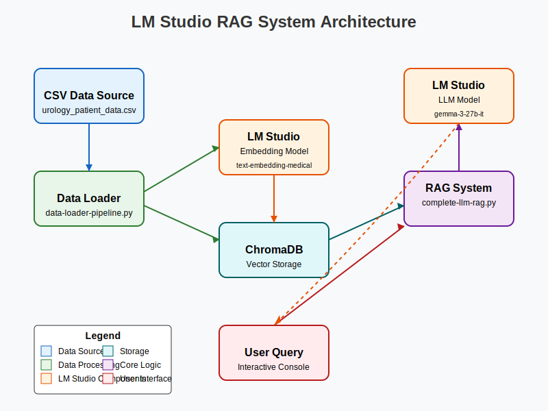

<<<<<<< HEAD
# llm-rag-healthcare
=======
# LLM RAG System with LM Studio

## Project Description

This project implements a Retrieval-Augmented Generation (RAG) system using LM Studio for both Large Language Models (LLMs) and embeddings. The system is designed to work with medical data, specifically urology patient records, to provide contextually relevant responses based on the patient data stored in a vector database.

The RAG system architecture comprises:
- Data processing pipeline for ingesting CSV files
- Vector embedding generation via LM Studio API
- ChromaDB for vector storage and similarity search
- Query processing with context augmentation
- Response generation through LM Studio's LLM capabilities

## System Architecture



The system follows a modular design pattern that separates concerns between data processing, embedding generation, retrieval mechanisms, and response generation. This approach enhances maintainability and allows for component-level optimization.

## Prerequisites

- Python 3.11.11 or 3.12
- macOS with M1 processor
- [LM Studio](https://lmstudio.ai/) application installed
- Poetry for dependency management

## Project Setup

### Setting up Poetry Environment

1. Clone the repository
   ```bash
   git clone <repository-url>
   cd llm-rag
   ```

2. Install Poetry (if not already installed)
   ```bash
   curl -sSL https://install.python-poetry.org | python3 -
   ```

3. Create and activate the environment
   ```bash
   poetry env use python3.11
   poetry shell
   ```

4. Install dependencies
   ```bash
   poetry install
   ```

### LM Studio Setup

1. Download and install LM Studio from [lmstudio.ai](https://lmstudio.ai/)

2. Open LM Studio and configure the following models:

#### Embedding Model Setup
- Navigate to the Embeddings tab in LM Studio
- Select the model: `text-embedding-medical-10-10-1-jinaai_jina-embeddings-v2-small-en-50-gpt-3.5-turbo-01_9062874564-i1`
- Ensure the API server is running on http://127.0.0.1:1234

#### LLM Model Setup
- Navigate to the Local Models tab
- Download the `lmstudio-community/gemma-3-27b-it-GGUF/gemma-3-27b-it-Q4_K_M.gguf` model
- Ensure the Chat Server is active on http://localhost:1234

## Data Generation

You can generate sample urology patient data using the data generator script:

```bash
python data-generator.py
```

This will create a `urology_patient_data.csv` file with 10 sample patient records.

## Loading Data

Load the generated data into ChromaDB with the data loader pipeline:

```bash
python data-loader-pipeline.py --interactive
```

Or directly specify the CSV file:

```bash
python data-loader-pipeline.py --csv urology_patient_data.csv
```

## Running the RAG System

Once the data is loaded and LM Studio is properly configured, run the complete RAG system:

```bash
python complete-llm-rag.py
```

This will start an interactive query session where you can ask questions about the urology patient data. The system will:

1. Search for relevant patient records in the vector database
2. Retrieve the most similar documents
3. Augment the query with relevant context
4. Generate a response using the LLM

## Example Queries

- "Which patients have been diagnosed with prostate cancer?"
- "What is the average PSA level for male patients over 60?"
- "Summarize the clinical notes for patient URO-2023005"
- "What medications are prescribed for patients with UTI?"

## Notes

- The system is optimized for medical data, specifically urology patient records
- Database backups are automatically created to prevent data corruption
- The LM Studio API must be running for both embeddings and LLM functionality
>>>>>>> 5133786 (first project commit)
